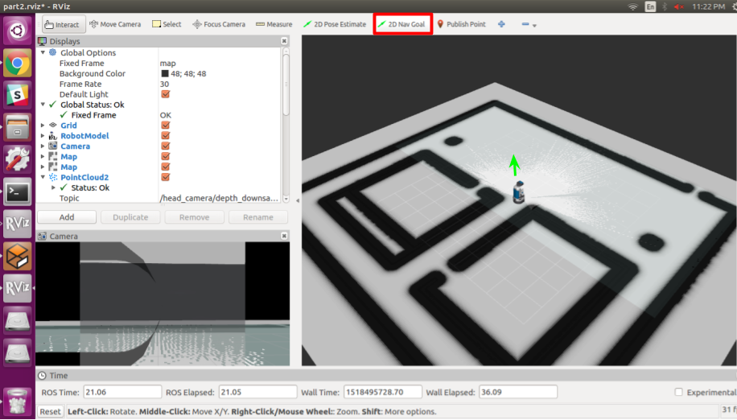

# Homework 2

1. Running the simulation environment is simple.

```
$ roslaunch hw2_group2_kad2185_rjk2147_yc3240 part1.launch
```


2. Run SLAM and drag the 2-D navigation goal as shown the picture.

```
$ roslaunch hw2_group2_kad2185_rjk2147_yc3240 part2.launch
```



3. Demonstrate Graspit! planning. The GUI will close after 10 seconds.

```
$ $ roslaunch hw2_group2_kad2185_rjk2147_yc3240 part3.launch
```
